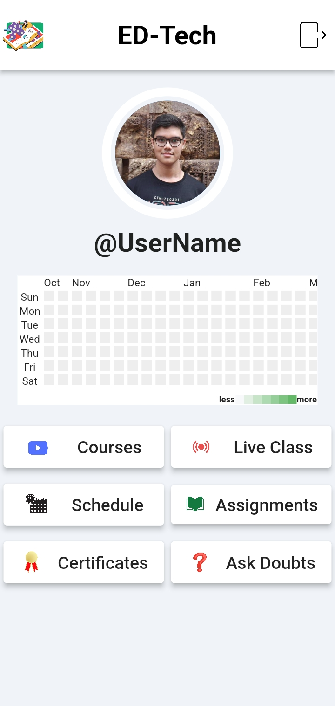

<h1 align="center">
             Ed-Tech APP
</h1>

  

## Overview of the App

<table>
<tr>
<td>
The Ed-Tech app is the part of Ed-Tech Platform which allows students to connect with classroom online. The Edtech App has authentication via admission number, schoolname, emailId and password which ensures only genuine students to use the platform. The Platform also has heatmap calender based attendence counting system which helps in understanding the attendence of the student visually along with the number of live classes he/she was present.
</td>
</tr>
</table>

There are 6 main sections in the app as follows -

1. <b>Courses</b> - This section displays the recorded videos of live classes in form of courses

2. <b>Live Class</b> - This section contains the ongoing live classes for the students in their particular section

3. <b>Schedule</b> - This section contains the timetable set for the week by the school/college of the student. 

4. <b>Assignments</b> - This section contains the 2 sections. The already submitted assignments where the students can check the correction done by the teacher in the assignments. The other section is the due assignments where the students need to submit their assignments.

5. <b>Certificates</b> - It contains the certificates issued by the school for the students. This section ensures that the certificates recieved by the students are organised in a proper manner and doesnt get lost.

6. <b>Ask a Doubt</b> - It is a section where the student can connect with their techers and ask a doubt. There is a general discussion forum in the platform as well where students can intercommunicate and solve each others doubts.

## Tech Stack Used -

 

## Future Prospects

- Improve the backend of the app by using Flask Framework
- Improve the videoplayer system of app for better user experience.

## UI Of The Mobile Application

     
        

## Run Locally

1.1 `git clone <repo link>`

1.2 Open in `Android Studio` and run `Emulator`

1.3 `flutter run` in Terminal

See the code [here](https://github.com/Soham-Chakraborty-8455/Edtech_App)
